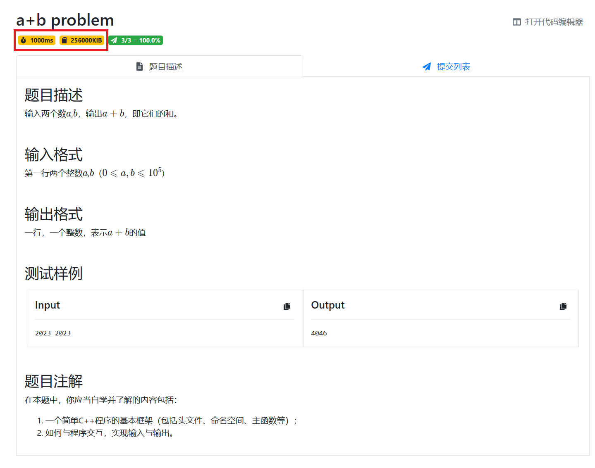
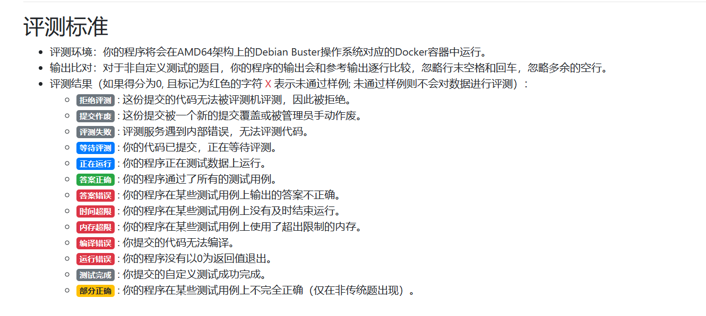
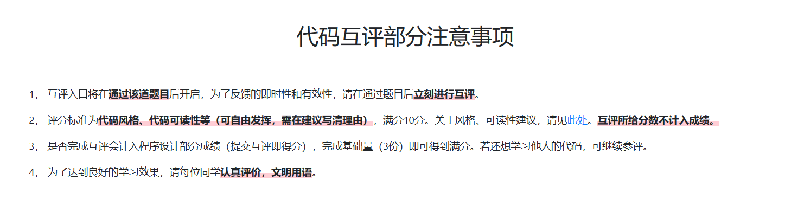

# OJ 使用指南

psoj 会伴随你度过两年美好的问题求解课程时光（如果你学业顺利的话），因此学习 psoj 的基本功能并熟练掌握之是必要的。

## 学会浏览题目

想要做好 OJ 题，学会看题是第一步。例如，对于这道a+b problem，我们有几点需要关注的地方：

#### 1. 关注题目所给任务

当然，你需要知道题目在说什么。一般来说，题目的基本信息会在**题目描述**一栏给出（根据 OJ 出题惯例，在这里你还可以看到一些绘声绘色的小故事）。题目故事的背景往往并不重要，重要的是题目让你实现什么样的**任务**。例如，在本题中，很显然地，题目要求你在输入两个数后，输出它们的和。

受出题人语文水平和不同人阅读水平的影响，有时候你可能会觉得题目给出的任务并不清晰或有歧义，你并不清楚自己具体需要做什么。这种时候可以额外关注**测试样例**一栏中出题人给出的 input sample 和 output sample 以求对题目所给任务的理解，毕竟往往数据的表达并没有歧义。在你看完**题目描述**觉得自己已经很清楚题意的情况下，**测试样例**也可以帮助你 double check 自己的理解。

#### 2. 关注评测时间、空间要求与数据范围

在你的代码被提交之后（如何提交详见下文）， OJ 评测机会用一些输入数据（一般是20组或10组）进行评测，并将你的代码输出与标准输出进行比对，以检测代码正确性。但这并不意味着一份代码只要对所有输入数据能输出正确的结果就能通过评测，代码还需要满足**时间**和**空间**要求。

例如，在本题中，<b>红框</b>部分代表本题对提交代码的时空要求。其中，**1000ms**表示对于本题中所有测试点，提交代码均需在1s内输出结果才有可能通过，否则算本测试点**时间超限**；**256000KiB**表示对于本题中所有测试点，提交代码运行时消耗内存不得超过256000KiB，否则算本测试点**内存超限**。

**一般来说，对于针对 OJ 题目的 C/C++ 代码，1000ms运行时间可以允许$10^8$量级次数的循环，256000KiB可以允许$10^6\sim 10^7$量级的int数组。**

此外，关注题目的数据范围也是必要的，数据范围一般会出现在**输入格式**或**题目描述**栏中。对于相同的题目任务要求，不同的数据范围可以对应不同的算法（解决方法），而不同的算法又有不同的时间与空间开销。在本题中，$a,b$的数据范围是$[0,10^5]$，但如果$a,b$可以是$10^{18}$呢？如果可以是$10^{100}$呢？原本“正确”的代码还可以顺利通过本题么？

> 如果有人让你做没给数据范围的 OJ 题，请默认 ta 在刁难你。

## 学会查看评测状态

当你的代码提交到 OJ 评测机上后，如果评测结果显示为**答案正确**，那么恭喜你，你通过了本题。但在大多数情况下，事情并不总是这么顺利。你可能会遇到各种以红框为背景的评测状态，这表明你的代码没有通过部分测试点，并且发生了如框内文字所描述的错误。特别地，如果你的代码犯了多种错误（比如在有的测试点**答案错误**，在有的测试点**时间超限**），那么 OJ 会优先反馈最先测试的测试点中的错误。

请特别关注**运行错误**，它发生的场景多种多样，例如数组越界、非法内存访问、除0错误、堆栈溢出（~~、插入了错误的assert语句~~）等。对错误原因的甄别能力也是 OJ 训练目标的一部分。

> 一些黑话：AC(Accepted) 答案正确；WA(Wrong Answer) 答案错误；TLE(Time Limit Exceeded) 时间超限；MLE(Memory Limit Exceeded) 内存超限；CE(Compile Error) 编译错误；RE(Runtime Error) 运行错误。

另，请特别关注**未通过样例则不会对数据进行评测**一句。

## 学会自定义测试

OJ 提供了如下图所示的自定义测试工具（在界面输入代码后点击**自定测试**即可，测试完成后点击**编程语言**一栏对应位置查看详情）。

**Q：我在本地可以运行代码，为什么还要用 OJ 自定义测试？**

因为本地环境和 OJ 编译环境可能不同，可能会导致本地程序正常运行但交上去在 OJ 评测无法通过的情况发生，自定义测试的作用就是帮你排查这种难以发现的情况。 OJ 编译环境和参数可以在 OJ 主页下方**帮助页面**中查看。

## 学会互评

<b>虽然互评给出的打分并不计入课程得分，但互评参与与否会影响最后问题求解 OJ 部分的分数，互评参与结果约占 OJ 部分分数的10%，因此请务必保证参与互评。</b>

**Q：我写代码已经很花时间了，干嘛还要让我互评？**

因为你需要学习别人的代码。可能有一些比较厉害的同学会觉得自己不用从同学那里学习，但其实很多有 OI 经历的同学的**代码规范**并不好，而且相比零基础的同学来说更难作出改变。互评既是一种对他人代码本身的学习与建议，也是一种对他人和自我**代码规范**和代码可读性提升的督促。

类似的，在大家的代码规范已经基本成型时，再只究代码规范便无太大意义。如果你看到这位同学的代码写的比较麻烦，请告诉他：可以用xxxx方法 / xxxx的方式；若你在这位同学的代码中学到了东西，请表示感谢。

**请你理解：看别人代码会帮助你进步。**

**Q：互评有无格式要求？**

一种推荐的格式：分条列出代码优点&分条列出代码缺点。

写互评时可以有自己的“文风”，但**这必须建立在文明、友好、完整表达互评应有意思的前提下**。

## 学会查看提交状态

**Q：“+1”是什么意思？“罚时”又是什么意思？**

STFW 和总结规律的能力都是 cs 学生不可或缺的，大家可以自行去观察或搜索并理解，这就当成是一个小训练吧。

**OJ罚时在问题求解实验部分中并不算分，最终 OJ 计分时并不会因为罚时带来的排名高低而影响你的分数。**